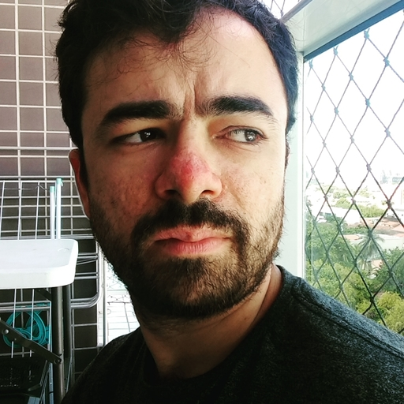

# funcional20221
Repositório utilizado para as atividades desenvolvidas durante a disciplina de programação funcional, ministrada pelo professor David Sena Oliveira ( github.com/senapk ), durante 2022.1. Universidade Federal do Ceará - Campus Quixadá

